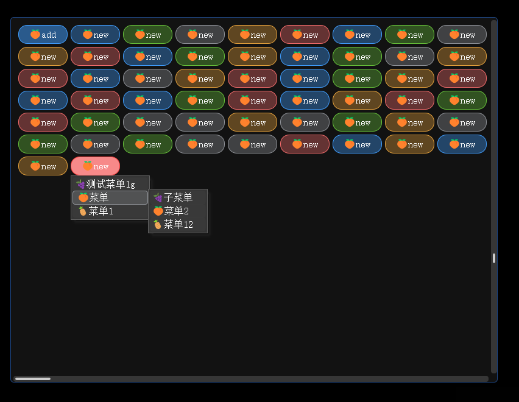
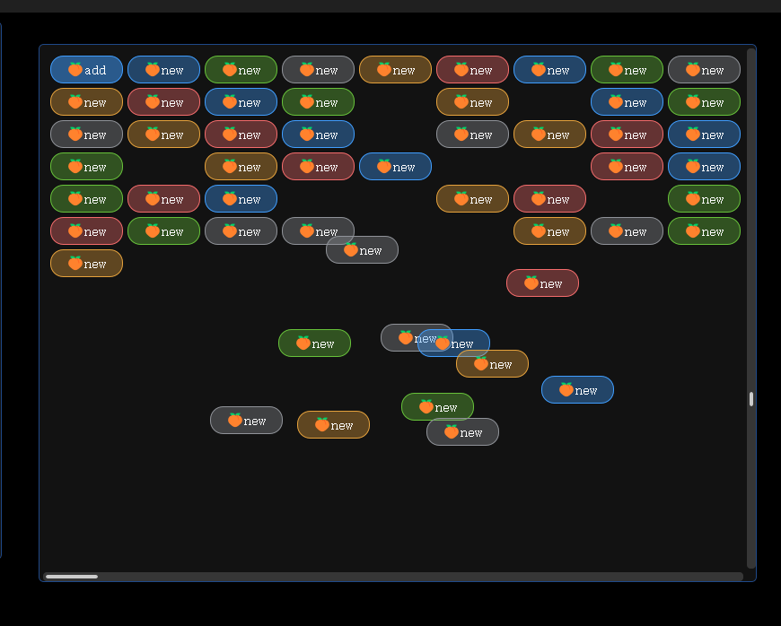

# pnguo vkgui
基于SDL3的简易gui实现。

编译说明：
1. 拉取仓库代码
```
git clone --depth 1 --recurse-submodules https://github.com/huahua369/pnguo.git
```
或
```
git clone --depth 1 https://github.com/huahua369/pnguo.git
``` 
```
git submodule update --init --recursive --depth 1
```
更新代码
```
git pull --depth 1 --allow-unrelated-histories
```
2. CMakeLists.txt可修改编译SDL3参数，SDL目录的vcxproj、sln建议删掉，本代码依赖库为静态库，如要改成引用动态库则改txt前面set(VCPKG_TARGET_TRIPLET x64-windows)
3. vcpkg安装依赖库，根据需求安装，例如```vcpkg install PkgConfig:x64-windows-static```
4. 渲染器依赖```vcpkg install pkgconf tinygltf glm stb nlohmann-json vulkan```
5. vcpkg安装示例```vcpkg install pkgconf openssl tinygltf glm stb nlohmann-json vulkan zlib pango cairo fontconfig harfbuzz exprtk clipper2 librsvg entt```
```
PkgConfig
SDL3
OpenSSL
tinygltf
glm
Stb
nlohmann_json
Vulkan
ZLIB
pango
cairo
fontconfig
harfbuzz
EXPRTK
Clipper2 Clipper2Z
libuv
LIBRSVG
GTHREAD
EnTT
OpenCV
vkvg
```

## To Do 

- [x] 2d骨骼动画渲染
- [x] 2d图集渲染
- [x] flex布局算法
- [x] 字体渲染管理
- [x] svg加载，支持滤镜
- [x] 面板
- [x] 按钮
- [x] 输入框：单行、多行
- [x] 多选框
- [x] 单选框
- [x] 开关控件
- [x] 滚动条 
- [x] 进度条
- [x] 颜色控件
- [x] 滑块控件
- [x] 菜单
- [ ] 表格视图
- [ ] 树形视图
- [ ] 属性视图
- [ ] 对话框
- [ ] 文本编辑、16进制文件编辑
- [x] gltf
	- [x] 动画
		- [x] Articulated (translate, rotate, scale)
		- [x] Skinned
		- [x] Morph targets
- [x] PBR管线
- [ ] 通用无光照管线
- [ ] 地形管线（光照）
- [ ] 粒子管线(光照)
- [ ] 粒子管线(无光照)
- [ ] 3D gizmo

## 描述
主实现在目录`third_party/vkgui` 文件读写、窗口创建等。


windows支持OLE拖放，支持渲染已有vulkan纹理，vkvg代码修改了一些编译错误。




